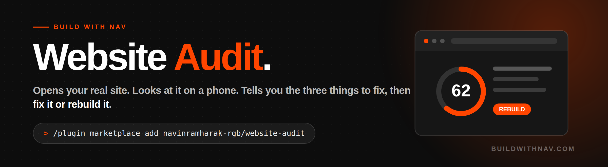

<p>


</p>

**Audit any website the way a good agency would, in about ten minutes.**

Most website advice is a checklist somebody hands you and never applies. This opens your actual site, looks at it on a phone, and comes back with a short list of what to fix in what order, plus a straight answer: **fix this, or rebuild it.**

Built for business owners, not marketers.

```
/plugin marketplace add navinramharak-rgb/website-audit
```

Then say: **"audit my website, it's yoursite.com"**

---

## The key to this skill

- **It actually looks.** Opens the real site at desktop and phone width. Never audits from the URL alone.
- **The five second test.** From the first screen on a phone: what do you sell, who is it for, what do I do next. If a stranger can't answer all three, that's finding number one, above every technical issue.
- **It counts the taps to reach you.** And checks whether your phone number is a real tap-to-call link or just text sitting on a page.
- **It ends with a decision, not a checklist.** Fix or rebuild. Everyone else hands you thirty findings. Nobody tells you which of the two jobs you're actually on.
- **Three things, not thirty.** Ranked hard, with what each one costs you and roughly how long it takes.
- **You get a report, not a chat.** One HTML file with a score, both screenshots, every finding quoted from your actual page, and a fix written out ready to paste. Opens offline, prints properly, forwards to a developer and still makes sense.
- **It never invents a number.** No made-up load times, traffic estimates or rankings. It measures it or says it couldn't.

---

## The seven lenses

| Lens | What it answers | Weight |
|---|---|---|
| Five second test | Can a stranger tell what you sell? | 25% |
| Path to contact | How hard is it to actually reach you? | 20% |
| Trust | Is there any proof you're real and good? | 15% |
| Mobile | Does it work on the thing people use? | 15% |
| Found in search | Can Google describe you properly? | 15% |
| Speed | What's the single biggest offender? | 10% |
| Local | City, service areas, address consistency | folded in |

You get a score out of 100 with the breakdown shown, so it isn't a black box.

## What comes back

One self-contained HTML page you could forward to a developer: the verdict, the three things to do this week, both screenshots side by side, then everything else honestly labelled as the later pile.

Every finding has three parts. **What's there** (quoted). **What it costs** (in enquiries, not in rules). **The fix** (written out, not described). A finding with no fix is a complaint, so it gets cut.

## What it knows it can't see

Schema markup injected by JavaScript is invisible to a plain fetch, because fetching tools strip `<script>` tags. So it either checks in a rendered browser or says it couldn't verify. Reporting "no schema found" from a plain fetch is the most common false finding in automated audits, and this skill refuses to produce it.

## Chains with

1. **Website Audit** ← you are here. Find out what's actually wrong.
2. **[Local SEO](https://github.com/navinramharak-rgb/local-seo)** — for local businesses, where the Google Business Profile usually does more work than the website. Free, takes an hour.
3. **[50k Website Builder](https://github.com/navinramharak-rgb/50k-website-builder)** — when the verdict is rebuild, hand it this audit as the brief instead of starting from a blank page.

For much deeper technical SEO (hreflang, crawl budget, international, programmatic pages), use [Corey Haines' marketing skills](https://github.com/coreyhaines31/marketingskills). Excellent library that goes further on that axis. This skill points at it rather than duplicating it.

---

MIT licence. Built by [Build With Nav](https://buildwithnav.com).
